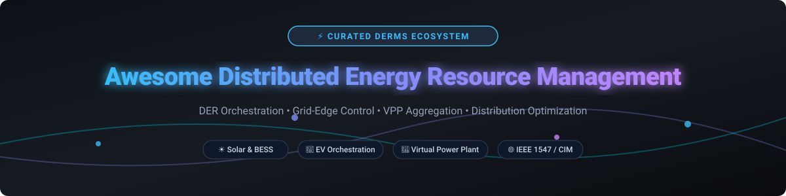
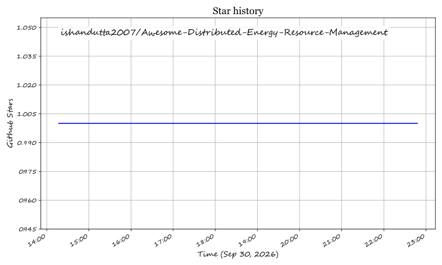

# ⚡ Awesome Distributed Energy Resource Management (DERMS)

  
  
  
  

> 🌐 **Curated List of Enterprise SaaS Platforms & Open-Source Projects for DER Orchestration, Grid-Edge Control, Virtual Power Plant (VPP) Aggregation, Hosting Capacity, & Smart Grid Optimization.**  
> 📅 *Last updated: September 2026*

---

## 📖 Table of Contents
- [📊 Industry Overview & Market Dynamics](#-industry-overview--market-dynamics)
- [🏢 SaaS & Hosted Enterprise Platforms](#-saas--hosted-enterprise-platforms)
- [💻 Open-Source GitHub Projects](#-open-source-github-projects)
- [🤝 How to Contribute](#-how-to-contribute)
- [☕ Support & Sponsorship](#-support--sponsorship)
- [⚠️ Disclaimer](#️-disclaimer)
- [📈 Star History](#-star-history)

---

## 📊 Industry Overview & Market Dynamics

The global **Distributed Energy Resource Management System (DERMS)** market size is valued at approximately **$1.8 Billion in 2026** and is projected to expand at a CAGR of over **18.5%**, reaching **$4.2 Billion by 2032**. 

The sector is **moderately fragmented**, transitioning toward strategic consolidation. While enterprise power grid conglomerates (Siemens, Schneider Electric, GE Vernova) hold dominant positions in operational utility integration, specialized SaaS pioneers (KrakenFlex, AutoGrid, EnergyHub) lead in Virtual Power Plant (VPP) aggregation and real-time demand response control.

---

## 🏢 SaaS & Hosted Enterprise Platforms

The table below lists top enterprise DERMS and VPP platforms, sorted in descending order by parent company market capitalization/valuation.

| Platform / Vendor 🚀 | Company Valuation / Revenue 💰 | Pricing Structure 💵 | Free Tier / Trial Limit 🆓 | Key Features & Focus ⚡ |
| :--- | :--- | :--- | :--- | :--- |
| **[GE Vernova GridOS](https://www.gevernova.com/grid-software)** | **$256.3B Valuation** ($45B Annual Rev) | Custom Enterprise Quote (Base Tier Starts ~$120,000/yr) | 14-Day Guided Sandbox Demo (Request via Enterprise Sales) | Enterprise ADMS & DERMS integration, dynamic grid capacity optimization. |
| **[Siemens Grid Software (Spectrum Power)](https://www.siemens.com/)** | **$222.8B Valuation** ($90B Annual Rev) | Custom Enterprise Quote (Starting Tier ~$150,000 Setup) | 30-Day Partner Evaluation Sandbox (Restricted to Utility Clients) | Utility SCADA integration, transmission & distribution joint optimization. |
| **[Schneider Electric DERMS](https://www.se.com/)** | **$169.7B Valuation** ($40.2B Annual Rev) | Custom Enterprise Licensing (Starts ~$100,000/yr) | 14-Day Enterprise Demo Access (Requires Account Manager Approval) | EcoStruxure ADMS suite integration, grid flexibility, IEEE 1547 compliance. |
| **[KrakenFlex (Kraken Tech)](https://kraken.tech/)** | **$8.7B Valuation** ($500M+ Contracted Rev) | Meter/Account-Based Licensing (~$2-$5/account/yr) | 30-Day Developer Sandbox & API Integration Trial | VPP aggregation, asset real-time dispatch, EV & BESS fleet control. |
| **[Smarter Grid Solutions (ANM Strata)](https://www.smartergridsolutions.com/)** | **$37.4M Est. Revenue** (Subsidiary of Mitsubishi Electric) | Enterprise Annual SaaS (~$50,000/yr starting module) | 14-Day Proof-of-Concept Trial for Grid Operators | Active Network Management (ANM), real-time constraint management. |
| **[EnergyHub](https://www.energyhub.com/)** | **$32.3M Est. Revenue** (Subsidiary of Alarm.com) | Utility MW Capacity Fee (Starts ~$30,000/yr base) | 30-Day Sandbox Access for OEM Device Integration Partners | Thermostat, EV & battery demand response programs for utilities. |
| **[AutoGrid (AutoGrid Flex)](https://www.auto-grid.com/)** | **$25.0M Est. Revenue** (Subsidiary of Schneider Electric) | Asset-Tier SaaS Subscription (Starts ~$40,000/yr) | 14-Day Guided Demo & VPP Simulation Access | AI-driven VPP forecasting, flexibility management, demand response. |
| **[Camus Energy](https://www.camus.energy/)** | **$12.5M Est. Revenue** (Series A Backed) | Grid Node Subscription (Starts ~$25,000/yr) | 30-Day Interactive Feeder Analytics Sandbox Trial | Zero-carbon grid orchestration, real-time distribution feeder visibility. |

---

## 💻 Open-Source GitHub Projects

Production DERMS rely heavily on enterprise platforms, but open-source projects excel in **distribution simulation**, **IEEE standards implementation**, **smart grid middleware**, and **research control loops**.

Projects are sorted below by GitHub Stars_Count (descending).

-  **[VOLTTRON](https://github.com/VOLTTRON/volttron)**  
  Open distributed sensing and control platform from DOE/PNNL—agent-based framework for building and DER coordination research.
-  **[GridLAB-D](https://github.com/gridlab-d/gridlab-d)**  
  Open-source power system simulation and analysis tool designed for distribution automation and smart-grid research, including DER scenarios.
-  **[HELICS (Hierarchical Engine for Large-scale Infrastructure Co-Simulation)](https://github.com/GMLC-TDC/HELICS)**  
  High-performance co-simulation framework developed by U.S. DOE labs to connect transmission, distribution, and DER control domain simulators.
-  **[GridAPPS-D](https://github.com/GRIDAPPSD/GOSS-GridAPPS-D)**  
  DOE-sponsored open platform that standardizes data models (IEC CIM) and APIs for developing and testing advanced distribution grid applications and DERMS control.
-  **[OpenDER (EPRI)](https://github.com/epri-dev/OpenDER)**  
  Open-source DER model implementing IEEE 1547-2018 behaviors for PV and BESS—steady-state and dynamic analysis, interfaced with OpenDSS.
-  **[OpenDSS (EPRI)](https://sourceforge.net/projects/electricdss/)**  
  Industry-standard open-source distribution system simulator—unbalanced power flow, QSTS, and DER impact studies used by utilities worldwide.
-  **[DERIM Middleware](https://github.com/iceccarelli/derim-middleware)**  
  Open smart-grid middleware for DER integration—telemetry normalization, CIM-aligned models, time-series storage, and digital twin hooks.
-  **[GridOS / Experimental DER OS](https://github.com/iceccarelli/GridOS)**  
  Emerging open energy operating system concepts—device registration, telemetry, Modbus/MQTT adapters, and basic control workflows.

---

## 🤝 How to Contribute

Contributions are warmly welcome! Help make this curated DERMS directory even more comprehensive.

1. 🍴 **Fork** the repository.
2. 📝 **Add/edit** entries in `README.md` following the established table or list formats.
3. 📌 Ensure you include: Name, verified link, key capabilities, pricing/star metrics.
4. 🚀 **Submit a Pull Request** with a short description of your changes.

Check out the [Awesome Lists](https://github.com/ishandutta2007/Awesome-Awesome-Awesome) index for more awesome collections!

---

## ☕ Support & Sponsorship

If you found this repository helpful for your grid energy research, utility project, or software development, please consider showing your support:

- ⭐ **Star this repository** on GitHub to increase its visibility.
- 🔄 **Share it** with fellow utility DER engineers, energy analysts, and grid software developers.
- 💖 **Sponsor the Project**: Consider buying a coffee or sponsoring maintenance on the [GitHub Sponsor Dashboard](https://github.com/sponsors/ishandutta2007).

---

## ⚠️ Disclaimer

- This is a **community-curated** list — provided for informational and research purposes.
- DERMS systems interact directly with critical physical power grid infrastructure. Only authorized grid operators and qualified personnel should deploy control logic to live assets. Always ensure full compliance with grid interconnection standards (e.g., IEEE 1547), operational security protocols, and OT cybersecurity guidelines.

---

## 📈 Star History

## Star History

<a href="https://star-history.com/#ishandutta2007/Awesome-Distributed-Energy-Resource-Management&Timeline" align="center">
  <picture>
    <source media="(prefers-color-scheme: dark)" srcset="assets/ishandutta2007_Awesome-Distributed-Energy-Resource-Management_growth.svg">
    
  </picture>
</a>
